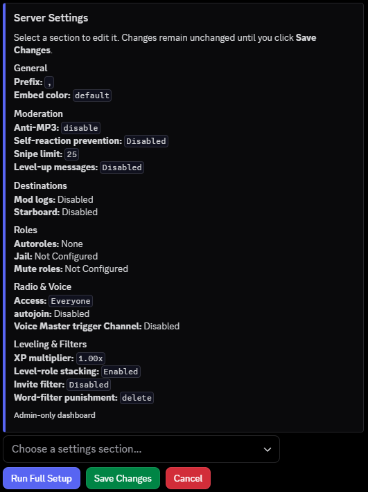

# GoBot

Notes: DiscordGo does not have its own dave implementation for the radio, so a large portion of it was mangled together
I really didn't want to figure it out and the plan was to switch to lavalink later. There is around 17k LOC of uncommitted testing files that I do not want on the repo.
GPT 6 Astra was used to do a final passover for the function names, user-facing msgs, most security related things, as well as comments to ensure it was all standardized.

There is around 300 commits that are not tracked in this specific repo, I wanted a fresh start on this and wanted to hide my stupid mistakes!

---

GoBot is a Juice Wrld focused general purpose discord bot written in Go. It handles moderation, server setup, radio and voice, leveling, Last.fm, giveaways, media tools, and a bunch of smaller utilities.

There are over 135 commands, with 300+ total sub-cmds overall. The full list is in [`docs/COMMANDS.md`](docs/COMMANDS.md).

## What it does

- **Moderation:** bans, kicks, mutes, timeouts, jail, purge, lockdowns, mod cases, snipes, role tools, and channel controls.
- **Filters:** word filters, regex filters, invite blocking, punishment rules, and whitelists.
- **Radio:** YouTube, SoundCloud, and local file playback with queues, playlists, search, history, looping, 24/7 mode, and Discord DAVE voice encryption.
- **Voice channels:** temporary user-owned rooms with locks, limits, access controls, ownership transfer, and claiming.
- **Leveling:** XP, multipliers, ignored channels, level roles, leaderboards, and rank cards.
- **Last.fm:** profiles, now playing, recents, charts, top tracks, top albums, top artists, taste comparisons, WhoKnows, and crowns.
- **Giveaways:** button entry, role requirements, account age checks, server tenure checks, rerolls, cancellation, and restart persistence.
- **Media tools:** yt-dlp and FFmpeg ripping, OCR, quote cards, embeds, emoji and sticker tools, translation, tags, and polls.
- **Juice WRLD:** song search, song info, random song selection, snippets, cover art, studio sessions, and radio integration.

## Requirements

- **Go 1.26**
- **FFmpeg & ffprobe**
- **yt-dlp**
- Discord bot token

FFmpeg, ffprobe, and yt-dlp can use system paths or paths set in `.env`.

## Setup

Clone the repo.

```bash
git clone https://github.com/lCloudyyl/gobot.git
cd gobot
```

Copy the example config.

```bash
cp .env.example .env
```

PowerShell:

```powershell
Copy-Item .env.example .env
```

Put your bot token in `.env`.

```env
DISCORD_TOKEN=your_bot_token_here
BOT_PREFIX=,
```

Run the bot.

```bash
go run .
```

Or build it first.

```bash
go build -o gobot .
./gobot
```

On Windows, run `gobot.exe`.

## Server setup

Most server settings are configured inside Discord with the setup command.

```text
,setup
``` 
*Replace ',' with your prefix*

The setup dashboard covers general server settings, mod logs, roles, starboard, voice and radio settings, and safeguards



## ENV config

| Var | Required | Default | What it controls |
| --- | --- | --- | --- |
| `DISCORD_TOKEN` | Yes | none | Discord bot token |
| `BOT_PREFIX` | No | `,` | Default prefix for message commands |
| `BOT_OWNERS` | No | none | Comma-separated bot owner user IDs |
| `FFMPEG_PATH` | No | `external/ffmpeg.exe` or `ffmpeg` | FFmpeg executable |
| `FFPROBE_PATH` | No | `external/ffprobe.exe` or `ffprobe` | ffprobe executable |
| `YTDLP_PATH` | No | `external/yt-dlp.exe` or `yt-dlp` | yt-dlp executable |
| `YTDLP_COOKIES_PATH` | No | `data/cookies.txt` | Optional yt-dlp cookies file |
| `LASTFM_API_KEY` | No | none | Last.fm commands |
| `OCR_SPACE_API_KEY` | No | none | OCR.Space requests |
| `DATABASE_PATH` | No | `data/bot.db` | SQLite database file |
| `LOG_LEVEL` | No | `info` | Log verbosity |
| `AUTO_BACKUP_ENABLED` | No | `true` | Automatic database backups |
| `AUTO_BACKUP_INTERVAL` | No | `24h` | Minimum time between backups |
| `BACKUP_RETENTION_COUNT` | No | `7` | Number of backups kept |
| `MAX_MEDIA_DOWNLOAD_SIZE_MB` | No | `50` | Ripper download size limit |
| `DATA_DIR` | No | `data` | Base data directory |

See [`.env.example`](.env.example) for the rest of the options and their defaults.

## Commands

Message commands use `BOT_PREFIX`. The default is `,`. Slash commands use `/`.

[`docs/COMMANDS.md`](docs/COMMANDS.md) is generated from the command definitions and includes aliases, usage, subcommands, descriptions, and known permission requirements.

Regenerate it after changing commands:

```bash
go generate ./...
```

## Docker

The repo includes a Docker file. The image includes Python, yt-dlp, and FFmpeg and runs the bot as an unprivileged user.

Build it:

```bash
docker build -t gobot .
```

Run it with `.env` and a persistent data volume:

```bash
docker run -d \
  --name gobot \
  --env-file .env \
  -v gobot_data:/app/data \
  gobot
```

## Project layout

```text
gobot/
├── cmd/
│   └── gendocs/          # command docs generator
├── config/               # environment parsing and validation
├── docs/                 # command reference and project docs
├── internal/
│   ├── bot/              # Discord client, routing, messaging, rate limits
│   ├── commands/
│   │   ├── filter/       # filters and automod
│   │   ├── giveaway/     # giveaways
│   │   ├── juicewrld/    # Juice WRLD Discord commands and UI embeds
│   │   ├── lastfm/       # Last.fm commands
│   │   ├── leveling/     # XP and levels
│   │   ├── moderation/   # moderation and server config
│   │   │   ├── roles/    # role management commands & interactions
│   │   │   └── setup/    # interactive server setup dashboard
│   │   ├── radio/        # radio commands, controls, and search menus
│   │   ├── ripper/       # media download commands
│   │   ├── utility/      # general utilities and fun
│   │   │   └── expressions/ # Emojis and sticker management
│   │   └── voice/        # temporary voice channels
│   ├── database/         # SQLite storage and migrations
│   ├── graphics/         # rank cards, charts, quote rendering
│   ├── handler/          # message and interaction routing
│   ├── helpers/          # shared helpers
│   ├── juicewrld/        # Juice WRLD API management
│   ├── listeners/        # Discord event listeners
│   ├── logger/           # logging
│   ├── modlog/           # moderation logs
│   ├── policy/           # command restrictions and execution checks
│   ├── radio/            # playback coordinator, queue, recovery, DAVE
│   ├── ripper/           # media download processing
│   ├── roles/            # role hierarchy and persistence coordinator
│   └── services/         # external service clients (Last.fm)
├── Dockerfile
├── go.mod
└── main.go               # startup and shutdown
```

## Stack

- **Discord:** [discordgo](https://github.com/bwmarrin/discordgo)
- **Database:** [modernc.org/sqlite](https://pkg.go.dev/modernc.org/sqlite)
- **DAVE:** [godave](https://github.com/disgoorg/godave) and [dave-go](https://github.com/thomas-vilte/dave-go)
- **Graphics:** [fogleman/gg](https://github.com/fogleman/gg) and [golang/freetype](https://github.com/golang/freetype)
- **Audio:** [jonas747/dca](https://github.com/jonas747/dca), FFmpeg, and ffprobe
- **Media extraction:** yt-dlp

## Development

Regenerate the command docs:

```bash
go generate ./...
```

## License

MIT. See [`LICENSE`](LICENSE).
